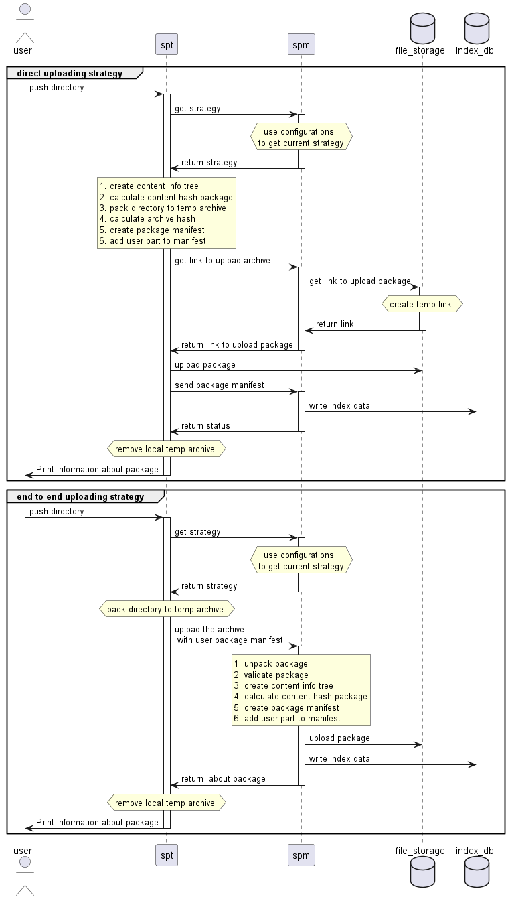

# [DRAFT] Simple Package Management Service

The goal of the SPM to allow to get simple way to use custom packages with any data.
It can be configurations, libraries,
assets and so on. The SPM service allows user to find required package by any these attribute and download to local computer.

### What is the Package

The package is usual archive which contains some additional meta information about a package content like version, hash, package description
and tags.
But in addition, the package can be endowed with any custom data. For example it can be git branch, tag or commit hash, author, license and
any key-value attributes.

### How to use SMP

To working on SMP you should use small terminal tool [spt]() - simple packaging tool which was named similar with [apt]().
Sure the apt is more powerful tool which supports features like package dependencies however some times is more useful to use more simple
thinks like spm + spt.

### Height level design

SPM supports several different uploading strategy.
The strategy can be chosen via service configurations.
The console tool asks service the actual strategy and decided how and where exactly push the package.

The first strategy is  **"direct uploading strategy"**. This strategy is faster way to upload package.
Also good benefit is less load on the server.
However the direct strategy theoretically can allow some user to upload a bad package because the server doesn't validate the package.
If yoy need more safety approach you can should use the the second strategy - **"end-to-end uploading strategy"**.



### Databases which can be used

* PostgreSql
* MongoDb
* SqlServer
* CassandraDb
* ScyllaDb

### Storages which can be used

* AWS S3
* Google Cloud Storage
* Azure Blob
* Local File System

### Configurations

1. [Configurations for API service](src/Spm.Web.Api/README.md)
2. [Configurations for GUI service](src/Spm.Web.Gui/README.md)

### Build and run locally

``` 
docker-compose build
docker-compose up
```

### Solution structure

* [docs](docs) - all project documentation
    * [md](docs/md) - markdown documents for wiki
    * [img](docs/img) - images for wiki
    * [uml](docs/uml) - uml diagrams to explain project architecture
* [src](src) - source code
    * [Spm.Data.Index.Mongo](src/Spm.Data.Index.Mongo) - DAL to working on MongoDb as indexing database
    * [Spm.Data.Index.Postgres](src/Spm.Data.Index.Postgres) - DAL to working on PostgreSql as indexing database
    * [Spm.Data.Storage.S3](src/Spm.Data.Storage.S3) - DAL to working on AWS S3 as package storage
    * [Spm.Data.Storage.Fs](src/Spm.Data.Storage.Fs) - DAL to working on local file system as package storage
    * [Spm.Domain](src/Spm.Domain) - core business domain logic
    * [Spm.Domain.Tests](src/Spm.Domain.Tests) - unit tests of core business domain logic
    * [Spm.Web.Api](src/Spm.Web.Api) - web API service
    * [Spm.Web.Client.Groc](src/Spm.Web.Client) - library with web client to working on Spm.Web.Api service
    * [Spm.Web.Client.Abstraction](src/Spm.Web.Client.Abstraction) - interfaces and DTOs for web client
    * [Spm.Web.Common](src/Spm.Web.Common) - shared between server and client code
    * [Spm.Web.Gui](src/Spm.Web.Gui) - web application with GUI to working on Spm.Web.Api service
    * [Spm.Web.Tests](src/Spm.Web.Tests) - unit tests for testing Spm.Web.Api and Spm.Web.GUI services
* [k8s](k8s) directory contains scripts and configurations to deploy SPM services to kubernetes
* [api.dockerfile]() file to build [Spm.Web.Api](src/Spm.Web.Api) service
* [gui.dockerfile]() file to build [Spm.Web.Gui](src/Spm.Web.Gui) service
* [docker-compose.yml]() file to build and deploy system on developer machine

